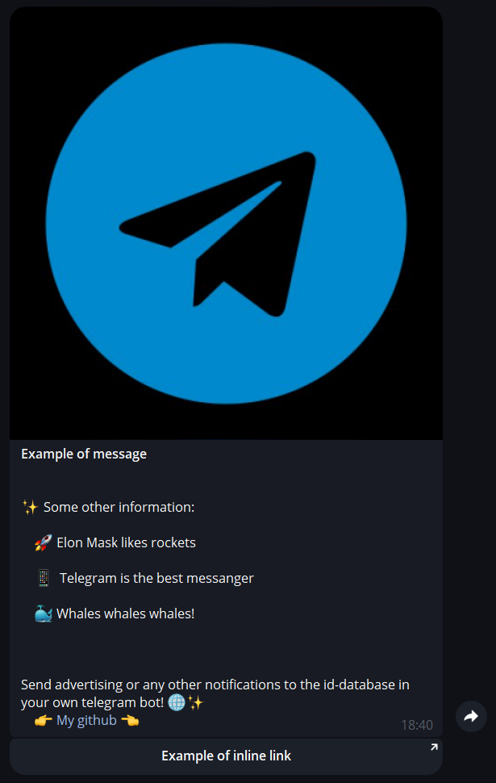
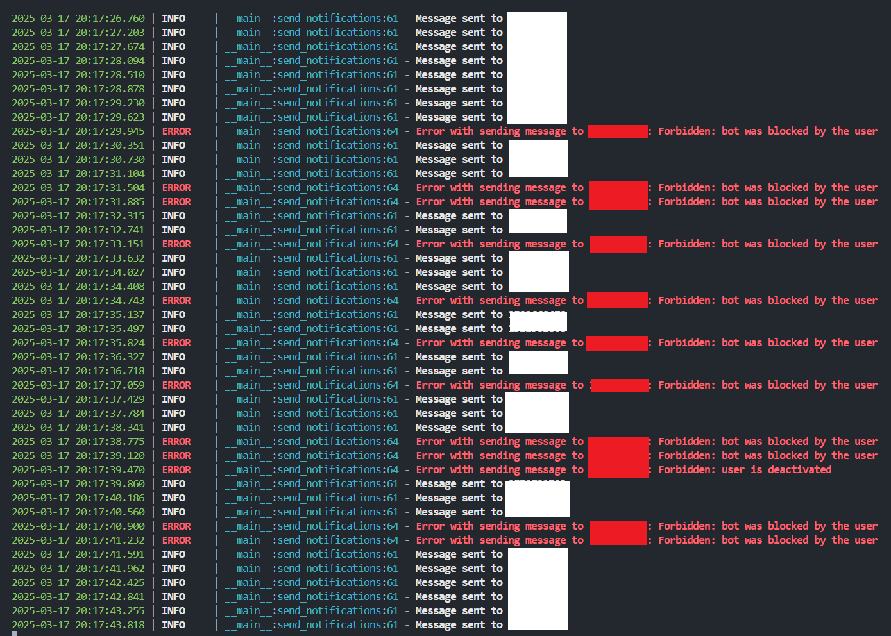

# TgBotSenderTool
Tool for sending advertising or any other notifications to the id-database in your telegram bot

## What was this utility written for?
The main need for this application is that not all backend telegram bots support effective sending alerts to users. This software allows you to make a sending alerts to your bot user base in a format convenient for you.

<details> <summary>Example of message that could be sent by this tool</summary>
<div align="center">
    
</div></details> 

<details> <summary>Screenshot of working log</summary>
<div align="center">
    
</div></details> 

## What is needed to launch?

### 1) Install requirements.txt
```
pip install -r requirements.txt
```
### 2) Put token of your bot in config.py
```
TelegramBotToken = 'Your_secret_tg_token' #from @BotFather
```
### 3) Extract telegram ids from your database and put it in database txt file
### 4) Prepare your text message file, image and inline buttons

# Example of usage

```
python sender.py --database ids.txt --text msg.txt --image image.png --inline inline.txt
```

All data format exaples in files ids.txt, inline.txt, msg.txt and image.png.


#### !TODO Multithreading, procentage with all statisctics
Also, you can merge it and develop whis soft together 

## Give star, if this tool was helpfull for you ⭐️
